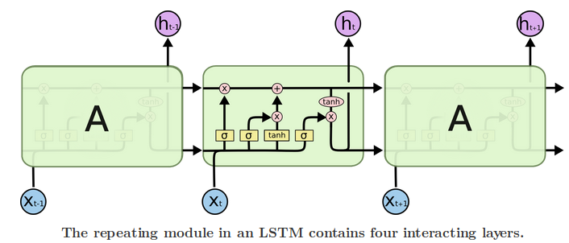

# Recurrent Neural Networks

Recurrent layers in Keras: https://keras.io/layers/recurrent/

The term "recurrent neural network" is used indiscriminately to refer to two broad classes of networks with a similar general structure, where one is finite impulse and the other is infinite impulse. Both classes of networks exhibit temporal dynamic behavior. A finite impulse recurrent network is a directed acyclic graph that can be unrolled and replaced with a strictly feedforward neural network, while an infinite impulse recurrent network is a directed cyclic graph that can not be unrolled. 

RNNs come in many variants: Fully recurrent, Independently recurrent (IndRNN), Recursive, Hopfield, Elman networks and Jordan networks, Echo state, Neural history compressor, Long short-term memory (LSTM), Gated recurrent unit, Bi-directional, Continuous-time, etc.

## Literature

- See the books listed on the [ANN page](NeuralNetworks.md)
- Francois Chollet's [links](https://github.com/fchollet/keras-resources)
- [The Unreasonable Effectiveness of Recurrent Neural Networks](http://karpathy.github.io/2015/05/21/rnn-effectiveness/) by Andrej Karpathy
- [Understanding LSTM Networks](http://colah.github.io/posts/2015-08-Understanding-LSTMs/) by Christopher Olah
- [Time series predictions with LSTM](https://machinelearningmastery.com/time-series-prediction-lstm-recurrent-neural-networks-python-keras/) by Jason Brownlee
- [Multivariate Time Series Forecasting with LSTMs](https://machinelearningmastery.com/multivariate-time-series-forecasting-lstms-keras/) by Jason Brownlee
- [Multi-step time series forecasting with Long Short-term Memory Networks](https://machinelearningmastery.com/multi-step-time-series-forecasting-long-short-term-memory-networks-python/) by Jason Brownlee
- [Tune LSTM hyperparameters in Keras time series forecasting](https://machinelearningmastery.com/tune-lstm-hyperparameters-keras-time-series-forecasting/) by Jason Brownlee
- [Understanding Keras LSTMs](https://stackoverflow.com/questions/38714959/understanding-keras-lstms) on Stackoverflow.

## LSTM - Long Short-term memory network

LSTM is a recurrent neural network that is trained using Backpropagation Through Time and overcomes the vanishing gradient problem. Instead of neurons, LSTM networks have memory blocks that are connected through layers. A block has components that make it smarter than a classical neuron and a memory for recent sequences. A block contains gates that manage the block’s state and output. A block operates upon an input sequence and each gate within a block uses the sigmoid activation units to control whether they are triggered or not, making the change of state and addition of information flowing through the block conditional.

There are three types of gates within a unit:
- Forget Gate: conditionally decides what information to throw away from the block.
- Input Gate: conditionally decides which values from the input to update the memory state.
- Output Gate: conditionally decides what to output based on input and the memory of the block.

Each unit is like a mini-state machine where the gates of the units have weights that are learned during the training procedure. Each of the three gates can be thought of as a "conventional" artificial neuron, as in a multi-layer (or feedforward) neural network: that is, they compute an activation (using an activation function) of a weighted sum. Intuitively, they can be thought as regulators of the flow of values that goes through the connections of the LSTM; hence the denotation "gate". The LSTM gates compute an activation, often using the logistic function. Intuitively, the input gate controls the extent to which a new value flows into the cell, the forget gate controls the extent to which a value remains in the cell and the output gate controls the extent to which the value in the cell is used to compute the output activation of the LSTM unit. A common LSTM unit is composed of a cell, an input gate, an output gate and a forget gate. The cell is responsible for "remembering" values over arbitrary time intervals; hence the word "memory" in LSTM.

LSTM module illustration by [Christopher Olah](http://colah.github.io/posts/2015-08-Understanding-LSTMs/):

- The first step in our LSTM is to decide what information we’re going to throw away from the cell state. This decision is made by a sigmoid layer called the "forget gate layer."
- The next step is to decide what new information we’re going to store in the cell state. This has two parts. First, a sigmoid layer called the “input gate layer” decides which values we’ll update. Next, a tanh layer creates a vector of new candidate values, C_t, that could be added to the state. Then, we’ll combine these two to create an update to the state.
- Finally, we need to decide what we’re going to output. This output will be based on our cell state, but will be a filtered version. First, we run a sigmoid layer which decides what parts of the cell state we’re going to output. Then, we put the cell state through tanh (to push the values to be between -1 and 1) and multiply it by the output of the sigmoid gate, so that we only output the parts we decided to.

### Variants

- Peephole: we let the gate layers look at the cell state.
- Coupled forget and input gates: instead of separately deciding what to forget and what we should add new information to, we make those decisions together. We only forget when we’re going to input something in its place.
- Gated Recurrent Unit (GRU): it combines the forget and input gates into a single “update gate.” It also merges the cell state and hidden state, and makes some other changes. The resulting model is simpler than standard LSTM models

### Backpropagation through time

### Keras implementation

- Input to LSTM: The input to every LSTM layer must be three-dimensional. The three dimensions of this input are:
    - Samples. One sequence is one sample. A batch is comprised of one or more samples.
    - Time Steps. One time step is one point of observation in the sample.
    - Features. One feature is one observation at a time step.
This means that the input layer expects a 3D array of data when fitting the model and when making predictions, even if specific dimensions of the array contain a single value, e.g. one sample or one feature.
Jason Brownlee's [tutorial](https://machinelearningmastery.com/reshape-input-data-long-short-term-memory-networks-keras/) expands on this.

- Stacked LSTMs: LSTM networks can be stacked in Keras in the same way that other layer types can be stacked. One addition to the configuration that is required is that an LSTM layer prior to each subsequent LSTM layer must return the sequence. This can be done by setting the return_sequences parameter on the layer to True.

- LSTM with Memory Between Batches: The LSTM network has memory, which is capable of remembering across long sequences. Normally, the state within the network is reset after each training batch when fitting the model, as well as each call to model.predict() or model.evaluate(). We can gain finer control over when the internal state of the LSTM network is cleared in Keras by making the LSTM layer “stateful”. This means that it can build state over the entire training sequence and even maintain that state if needed to make predictions. It requires that the training data not be shuffled when fitting the network. It also requires explicit resetting of the network state after each exposure to the training data (epoch) by calls to model.reset_states(). This means that we must create our own outer loop of epochs and within each epoch call model.fit() and model.reset_states(). Finally, when the LSTM layer is constructed, the stateful parameter must be set True and instead of specifying the input dimensions, we must hard code the number of samples in a batch, number of time steps in a sample and number of features in a time step by setting the batch_input_shape parameter.
