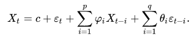
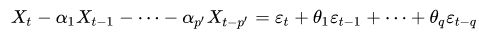
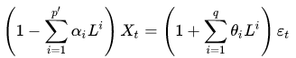
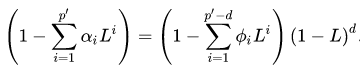
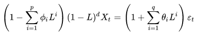

# ARIMA

ARIMA is a time series forecasting model. It has three components: an auto-regression (AR) term, an "integrated" (I) term, and a moving average (MA) term. ARIMA is a generalization of an autoregressive moving average (ARMA) model.

The AR part of ARIMA indicates that the evolving variable of interest is regressed on its own lagged (i.e., prior) values. The MA part indicates that the regression error is actually a linear combination of error terms whose values occurred contemporaneously and at various times in the past. The I indicates that the data values have been replaced with the difference between their values and the previous values to remove non-stationarity.

## Examples, references

- PennState [lecture](https://onlinecourses.science.psu.edu/stat510/node/49/)
- Jason Brownlee's ARIMA [post 1](https://machinelearningmastery.com/arima-for-time-series-forecasting-with-python/)
- Jason Brownless's ARIMA [post 2](https://machinelearningmastery.com/make-sample-forecasts-arima-python/)
- Arindam Chatterjee on Kaggle about "[Time series for beginners with ARIMA](https://www.kaggle.com/freespirit08/time-series-for-beginners-with-arima/notebook?utm_medium=email&utm_source=mailchimp&utm_campaign=datanotes-20180823)"
- Xiaoyu Sun on Kaggle about "[Understand ARIMA and tune P, D, Q](https://www.kaggle.com/sumi25/understand-arima-and-tune-p-d-q/notebook?utm_medium=email&utm_source=mailchimp&utm_campaign=datanotes-20180823)
- Wikipedia [article](https://en.wikipedia.org/wiki/Autoregressive_integrated_moving_average)
- Robert Nau on [ARIMA](https://people.duke.edu/~rnau/411arim.htm)

## Definitions: ARMA and ARIMA

The **ARMA(p,q)** model in general combines the dependence of X_t on its earlier values (X_{t-1}, X_{t-2}, etc.) --AT model-- and on the earlier error values (epsilon_{t-1}, epsilon_{t-2}, etc.) --MA model--. This can be expressed in the following form: 
 

If we assume that C=0 and replace symbols with others, an alternative formula is the following: 
 
We will use proceed using this form.
Let's introduce the L time shift (or lag) operator: L(X_t) = L(X_{t-1}). With L, we can re-write the ARMA model for X_t in the following form: 
 

Enter the concept of integrated time series. Let's take the left side of the above equation and assume that the polynomial on the left side (polynomial of L) has d number of unit roots. In this case, the left side can be re-written as 
 

Now, we are ready to define the **ARIMA(p,d,q)** model as follows: 
 

It is worth to draw attention to a few special cases:
- ARIMA(0,0,0): X_t = epsilon_t, which describes white noise
- ARIMA(0,1,0): X_t = X_{t-1} + epsilon_t, which describes a random walk

## Stationarity

## Software
- Python: statsmodels.tsa.arima_model
- Scala: https://github.com/sryza/spark-timeseries ([ARIMA](https://github.com/sryza/spark-timeseries/blob/master/src/main/scala/com/cloudera/sparkts/models/ARIMA.scala))

